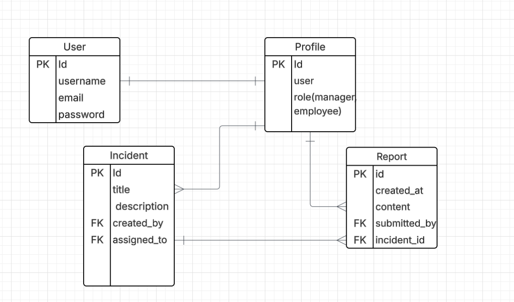

# 🔐 Security Incident Tracker - Backend

This is the backend repository for the **Security Incident Tracker** application — a full-stack web app designed to help security teams log, track, and manage security incidents efficiently. Built with Django and Django REST Framework, the backend provides a secure RESTful API for managing users, incident reports, and resolution notes.

---

## ⚙️ Tech Stack

- Python 3
- Django
- Django REST Framework
- PostgreSQL
- JWT Authentication (via `djangorestframework-simplejwt`)
- Docker & Docker Compose
- CORS Headers
- dotenv for environment config

---

## 🔗 Frontend Repository

[Frontend GitHub Repository](https://github.com/Rawan0102/SecurityIncidentTracker_frontend)

---

## 🌐 Deployed Site

[https://security-tracker-client.netlify.app](https://security-tracker-client.netlify.app)

---

## 📊 ERD Diagram

---

## 📡 Routing Table

| Route                     | Method | Description                             | Auth Required |
|--------------------------|--------|-----------------------------------------|---------------|
| /api/token/              | POST   | Obtain JWT Token                        | ❌            |
| /api/token/refresh/      | POST   | Refresh JWT Token                       | ❌            |
| /api/incidents/          | GET    | List all incidents                      | ✅            |
| /api/incidents/          | POST   | Create a new incident                   | ✅            |
| /api/incidents/:id/      | GET    | Get incident by ID                      | ✅            |
| /api/incidents/:id/      | PUT    | Update incident                         | ✅ (Owner/Admin) |
| /api/incidents/:id/      | DELETE | Delete incident                         | ✅ (Owner/Admin) |
| /api/incidents/:id/notes/| POST   | Add note to incident                    | ✅            |
| /api/notes/:id/          | PUT    | Edit note                               | ✅ (Owner)     |
| /api/notes/:id/          | DELETE | Delete note                             | ✅ (Owner)     |

---

## 🐳 Docker Installation Instructions

## ❄️ IceBox Features (Planned)

- [ ] Incident categorization by severity
- [ ] Auto-archive resolved incidents after 30 days
- [ ] Admin panel with full analytics dashboard
- [ ] Logging and audit trails for data changes
- [ ] Tag-based filtering system
- [ ] REST API documentation with Swagger/OpenAPI
- [ ] 2FA support for admin login
- [ ] File upload for evidence/attachments
- [ ] Rate limiting and brute-force protection